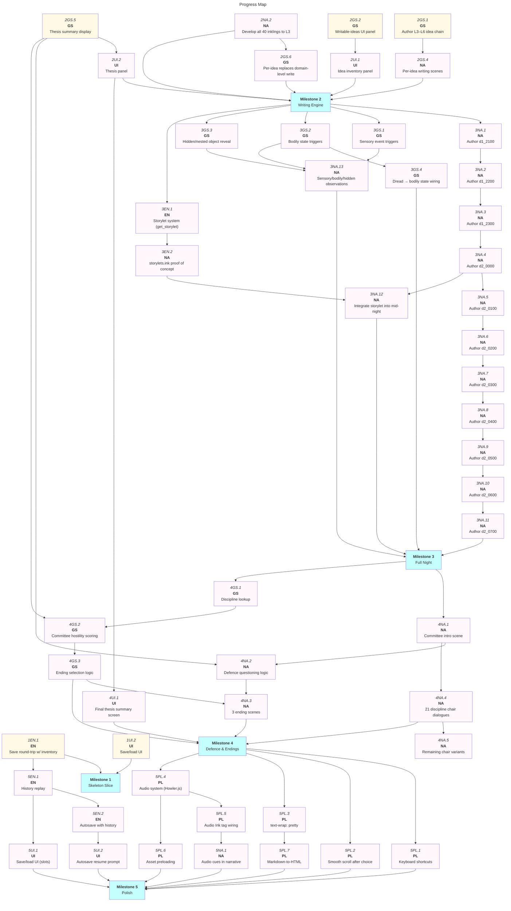

# The Work: MVP Roadmap

|          | Status                          | Next Up                       | Blocked                        |
| -------- | ------------------------------- | ----------------------------- | ------------------------------ |
| **NA**   | All objects + writing authored  | Author L3–L6 idea content     | —                              |
| **GS**   | Idea pipeline wired E2E         | Author L3–L6 idea content (2GS.1) | —                         |
| **UI**   | StatusBar, ChoiceList, autosave | Writable-ideas panel (2GS.2)  | —                              |
| **EN**   | Nib stable; autosave wired      | Save round-trip w/ inventory  | —                              |
| **PL**   | Not started                     | Keyboard shortcuts            | Stable content (M3)            |

---

## Contents

- [Milestones](#milestones)
  - [Milestone 1: Skeleton Slice](#m1)
  - [Milestone 2: Writing Engine](#m2)
  - [Milestone 3: Full Night](#m3)
  - [Milestone 4: Defence & Endings](#m4)
  - [Milestone 5: Polish](#m5)
- [Progress Map](#map)
- [Beyond MVP](#post-mvp)

---

## Milestones

<a name="m1"><h3>Milestone 1: Skeleton Slice</h3></a>

> [!IMPORTANT]
> **Goal:** A narrow end-to-end playable slice — one object examined, one observation acquired, developed to inkling then idea (L3), written to thesis, and the defence stub reachable. All mechanics present in minimal form; no content breadth yet.

<a name="m1-doing"><h4>In Progress (Milestone 1)</h4></a>

- [ ] 1EN.1. Confirm Nib `saveState` / `loadState` round-trips correctly with idea inventory — Ink state round-trips; **idea inventory is NOT included in save data** (`inventory.toJSON()`/`fromJSON()` exist but are never called from save-load.ts)
- [ ] 1UI.2. Surface save/load UI (trigger save, restore from save) — autosave + "Continue" button works; **no manual save/load UI yet**

<a name="m1-todo"><h4>To Do (Milestone 1)</h4></a>

<a name="m1-blocked"><h4>Blocked (Milestone 1)</h4></a>

<a name="m1-done"><h4>Completed (Milestone 1)</h4></a>

- [x] 1EN.3. Nib engine stable (story.svelte.ts, tags.ts)
- [x] 1GS.5. Idea data model (IdeaDef, PromptDef, inventory) implemented
- [x] 1GS.6. All external functions bound in idea-bridge.ts
- [x] 1GS.7. 67 observations and 40 inklings registered in idea-catalog.ts
- [x] 1GS.8. Recipes engine (develop + combine) implemented
- [x] 1GS.9. Orthodoxy scoring implemented
- [x] 1UI.3. StatusBar, ChoiceList, Passage, DevBar, Grain components built
- [x] 1NA.7. Hours d1_1830, d1_1900, d1_2000 authored and playable
- [x] 1NA.1. Author one complete object examination in Ink (observation → choice of reading) — 48 objects authored across 6 locations (144 readings)
- [x] 1NA.2. Author development path from one observation to one inkling (L2) — dozens of O→I recipes across all 7 domains
- [x] 1NA.3. Author development path from inkling to one L3 idea — 23 I→C recipes registered
- [x] 1NA.4. Author minimal per-idea writing scene in Ink (select L3 idea, commit to thesis) — per-idea selective writing implemented in Tunnels.ink
- [x] 1NA.5. ~~Stub all unwritten hours~~ — superseded: d1_2000 loop design handles all hours via TimeNumber, no stubs needed
- [x] 1NA.6. Wire hour stubs into main story so full narrative compiles and reaches d2_0800 — d1_2000 loop reaches d2_0800 via `TimeNumber >= 20` check
- [x] 1GS.1. Confirm `acquire_idea`, `develop_idea`, `combine_ideas` work end-to-end with authored Ink
- [x] 1GS.2. Confirm `write_idea` correctly gates on level >= 3 and marks idea as written
- [x] 1GS.3. Wire `write_idea` / `writable_idea_at` / `writable_idea_count` external functions into Ink writing scene — all declared in IdeaSystem.ink, bound in idea-bridge.ts, called from Tunnels.ink
- [x] 1EN.2. Wire `save-load.ts` autosave to fire on each `story.continue()` call — fires in continueStory() in +page.svelte
- [x] 1UI.1. Add `ConvictionDesc` Ink variable output to StatusBar — reads from Ink variable, displays in StatusBar.svelte
- [x] 1GS.4. Implement discipline detection (dominant domain pair from written ideas) — `getDominantPair()` + `disciplines.ts` lookup table + `get_discipline()` Ink external + StatusBar display

---

<a name="m2"><h3>Milestone 2: Writing Engine</h3></a>

> [!IMPORTANT]
> **Goal:** Per-idea selective writing is fully playable — the player can see which ideas they hold, choose which to include in the thesis, and the thesis tracks orthodoxy and discipline correctly. Ink content exists for at least one domain's full idea chain (L1–L6).

<a name="m2-doing"><h4>In Progress (Milestone 2)</h4></a>

<a name="m2-todo"><h4>To Do (Milestone 2)</h4></a>

- [ ] 2GS.1. Author L3–L6 idea content for one domain (minimum one complete chain) — **unblocked** (1GS.4 complete)
- [ ] 2GS.2. Implement writable-ideas UI panel (display held ideas, highlight writable, show level/orthodoxy) — **unblocked** (1GS.2 complete)
- [ ] 2GS.4. Author per-idea writing scenes for each L3+ idea in the authored chain — **depends on 2GS.1**
- [ ] 2GS.5. Display thesis summary (written ideas, dominant domains, discipline name) in UI — **unblocked** (1GS.4 complete)
- [ ] 2NA.2. Author development paths for all 40 existing inklings to at least L3 — **depends on 2GS.1**
- [ ] 2UI.1. Idea inventory panel — see held ideas, their level, and whether writable — **depends on 2GS.2**
- [ ] 2UI.2. Thesis panel — see written ideas and current orthodoxy per domain — **depends on 2GS.5**

<a name="m2-blocked"><h4>Blocked (Milestone 2)</h4></a>

- [ ] 2GS.6. Per-domain writing action replaces domain-level `get_written_level` calls in Ink — **depends on 2NA.2**

<a name="m2-done"><h4>Completed (Milestone 2)</h4></a>

- [x] 2GS.3. Wire writing action into Ink: player selects idea by index from writable list, commits, receives confirmation text — already implemented in Tunnels.ink via `writable_idea_at()` + `write_idea()` + `printWriteResultForIdea()`
- [x] 2NA.1. Author one combination recipe (two inklings → one idea) in Ink and recipes.ts — multiple exist: I26+I27→C14, I1+I6→C14, plus ~20 observation-level combination recipes

---

<a name="m3"><h3>Milestone 3: Full Night</h3></a>

> [!IMPORTANT]
> **Goal:** All hours authored (d1_2100–d2_0700). Sensory events, bodily states, and hidden/nested objects have trigger mechanisms. Storylet system proves out with at least one working dynamic passage. The full night is playable start to finish.

<a name="m3-doing"><h4>In Progress (Milestone 3)</h4></a>

<a name="m3-todo"><h4>To Do (Milestone 3)</h4></a>

- [ ] 3NA.1. Author d1_2100 (hour 3) — d1_2000 loop already handles time; this is about adding hour-specific narrative flavour
- [ ] 3NA.2. Author d1_2200 (hour 4) — **depends on 3NA.1**
- [ ] 3NA.3. Author d1_2300 (hour 5) — **depends on 3NA.2**
- [ ] 3NA.4. Author d2_0000 (midnight, hour 6) — **depends on 3NA.3**
- [ ] 3NA.5. Author d2_0100 (hour 7) — **depends on 3NA.4**
- [ ] 3NA.6. Author d2_0200 (hour 8) — **depends on 3NA.5**
- [ ] 3NA.7. Author d2_0300 (hour 9) — **depends on 3NA.6**
- [ ] 3NA.8. Author d2_0400 (hour 10) — **depends on 3NA.7**
- [ ] 3NA.9. Author d2_0500 (hour 11) — **depends on 3NA.8**
- [ ] 3NA.10. Author d2_0600 (hour 12) — **depends on 3NA.9**
- [ ] 3NA.11. Author d2_0700 (hour 13, final night hour) — **depends on 3NA.10**
- [ ] 3GS.1. Implement sensory event trigger mechanism in Ink (tag-based or external function)
- [ ] 3GS.2. Implement bodily state triggers (fatigue, hunger, dread thresholds)
- [ ] 3GS.3. Implement hidden/nested object reveal mechanism
- [ ] 3GS.4. Wire dread accumulation to bodily state triggers — **depends on 3GS.2, 1GS.9**
- [ ] 3EN.1. Implement storylet system (port `get_storylet` external function from calico-patches.md)
- [ ] 3EN.2. Author storylets.ink with at least one proof-of-concept dynamic passage — **depends on 3EN.1**
- [ ] 3NA.12. Integrate at least one storylet into a mid-night hour — **depends on 3EN.2, 3NA.4**

<a name="m3-blocked"><h4>Blocked (Milestone 3)</h4></a>

- [ ] 3NA.13. Extend observations to sensory/bodily/hidden prompt locations — **depends on 3GS.1, 3GS.2, 3GS.3**

<a name="m3-done"><h4>Completed (Milestone 3)</h4></a>

---

<a name="m4"><h3>Milestone 4: Defence & Endings</h3></a>

> [!IMPORTANT]
> **Goal:** The thesis defence (d2_0800) is fully authored. Committee membership and chair emerge from the dominant discipline. Orthodoxy scores drive committee hostility or approval. Multiple distinct endings are reachable.

<a name="m4-doing"><h4>In Progress (Milestone 4)</h4></a>

<a name="m4-todo"><h4>To Do (Milestone 4)</h4></a>

- [ ] 4NA.1. Author committee introduction scene (committee composition announced, chair identified) — **depends on M3**
- [ ] 4NA.2. Author defence questioning logic (committee challenges based on thesis orthodoxy) — **depends on 4NA.1, 2GS.5**
- [ ] 4NA.3. Author at least 3 distinct ending scenes (pass orthodox, pass radical, fail) — **depends on 4NA.2**
- [ ] 4NA.4. Author all 21 discipline-specific committee chair dialogue variants — **depends on 4NA.1**
- [ ] 4GS.1. Implement discipline lookup (domain pair → discipline name → committee chair) — **depends on M3**; discipline detection (1GS.4) complete
- [ ] 4GS.2. Implement committee hostility scoring from written orthodoxy profile — **depends on 2GS.5, 4GS.1**
- [ ] 4GS.3. Implement ending selection logic based on thesis profile + dread levels — **depends on 4GS.2**
- [ ] 4UI.1. Add final thesis summary screen before defence begins — **depends on 2UI.2**

<a name="m4-blocked"><h4>Blocked (Milestone 4)</h4></a>

- [ ] 4NA.5. Author remaining discipline chair variants (after first 3 proven out) — **depends on 4NA.4**

<a name="m4-done"><h4>Completed (Milestone 4)</h4></a>

---

<a name="m5"><h3>Milestone 5: Polish</h3></a>

> [!IMPORTANT]
> **Goal:** The game feels complete. Save/load with history replay, autosave on passage, keyboard shortcuts, smooth scroll after choice, audio system, and typography are all in place. Ready to ship.

<a name="m5-doing"><h4>In Progress (Milestone 5)</h4></a>

<a name="m5-todo"><h4>To Do (Milestone 5)</h4></a>

- [ ] 5PL.1. Implement keyboard shortcuts for choices (1–9, z/x/c, Space) in ChoiceList.svelte
- [ ] 5PL.2. Implement smooth scroll-after-choice (scrollIntoView or Svelte action)
- [ ] 5PL.3. Apply `text-wrap: pretty` for orphan prevention
- [ ] 5EN.1. Implement history replay for save/load (record choice indices, restore seed, replay silently) — **depends on 1EN.1**
- [ ] 5EN.2. Wire autosave to fire on `story.continue()` with history-aware state — **depends on 5EN.1**
- [ ] 5UI.1. Save/load UI (save slot, load from slot, delete save) — **depends on 5EN.1**
- [ ] 5UI.2. Autosave resume prompt on page load ("Continue where you left off?") — **depends on 5EN.2**
- [ ] 5PL.4. Implement audio system (Howler.js-based, port from calico-patches.md) — **depends on 5PL.2**
- [ ] 5PL.5. Wire `#play`, `#pause`, `#stop`, `#volume` Ink tags to audio system — **depends on 5PL.4**
- [ ] 5NA.1. Add audio cues to key narrative moments — **depends on 5PL.5**
- [ ] 5PL.6. Asset preloading (scan compiled Ink JSON for audio/image refs, show progress) — **depends on 5PL.4**

<a name="m5-blocked"><h4>Blocked (Milestone 5)</h4></a>

- [ ] 5PL.7. Markdown-to-HTML for `**bold**` / `*italic*` in Ink text — **depends on 5PL.3**

<a name="m5-done"><h4>Completed (Milestone 5)</h4></a>

---

<a name="map"><h2>Progress Map</h2></a>

---

<a name="post-mvp"><h2>Beyond MVP</h2></a>

Features explicitly deferred from MVP scope:

- **Parallax frames** (`#frame:` tag, layered images with mouse tracking) — only relevant for atmospheric scenes
- **Drag-to-scroll** — atmospheric nice-to-have, may conflict with text selection
- **Multi-format save storage** (cookies, session, local) — localStorage sufficient for MVP
- **Rewind / step-back** — full choice replay system; desirable but not required for first release
- **Choice tags** (peek-ahead into choice target paths for `#class:` application) — partial coverage already in tags.ts
- **Asset preloading progress bar** — only relevant once audio is dense enough to need it
- **Full 67-observation Ink coverage** — 48 of 67 objects authored; remaining 19 (sensory P49–P53, bodily P54–P58, hidden/nested P59–P67) need different trigger mechanisms
