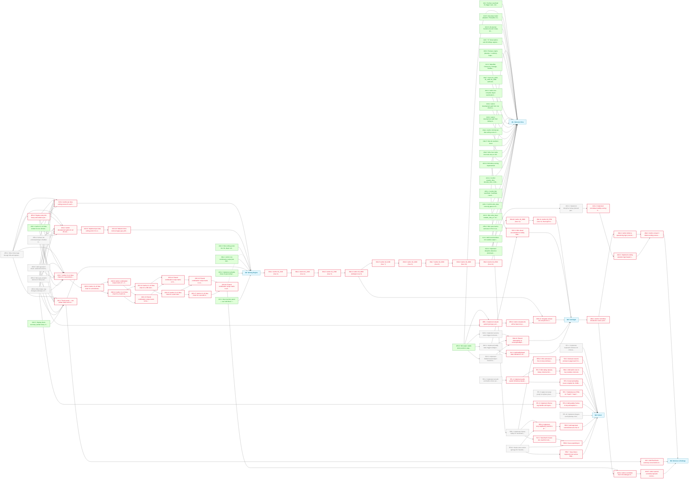

# The Work MVP Roadmap

End-to-end skeleton through full night, defence, and polish.

**Critical path:** `M2 → 3NA.1 → 3NA.2 → … → 3NA.11 → M3 → 4NA.1 → 4NA.2 → 4NA.3 → M4`; the night-hour chain (M3) is the longest single dependency run and gates the defence milestone.

---

## Milestone 1: Skeleton Slice

**Goal:** A narrow end-to-end playable slice — one object examined, one observation acquired, developed to inkling then idea (L3), written to thesis, and the defence stub reachable. All mechanics present in minimal form; no content breadth yet.

- [x] **1EN.1**: Confirm Nib saveState / loadState round-trips correctly with idea inventory
  - Note: Inventory persisted via toJSON()/fromJSON() in autosave and manual save; SaveData.inventoryState optional field with graceful degradation
- [x] **1UI.2**: Surface save/load UI (trigger save, restore from save)
  - Note: Escape key opens pause overlay (Save, Load Save, Quit to Menu, Resume); Ctrl+S / Cmd+S shortcut; "Saved" toast confirmation; Load Save on menu page
- [x] **1EN.3**: Nib engine stable (story.svelte.ts, tags.ts)
- [x] **1GS.5**: Idea data model (IdeaDef, PromptDef, inventory) implemented
- [x] **1GS.6**: All external functions bound in idea-bridge.ts
- [x] **1GS.7**: 67 observations and 40 inklings registered in idea-catalog.ts
- [x] **1GS.8**: Recipes engine (develop + combine) implemented
- [x] **1GS.9**: Orthodoxy scoring implemented
- [x] **1UI.3**: StatusBar, ChoiceList, Passage, DevBar, Grain components built
- [x] **1NA.7**: Hours d1_1830, d1_1900, d1_2000 authored and playable
- [x] **1NA.1**: Author one complete object examination in Ink (observation → choice of reading)
  - Note: 48 objects authored across 6 locations (144 readings)
- [x] **1NA.2**: Author development path from one observation to one inkling (L2)
  - Note: Dozens of O→I recipes across all 7 domains
- [x] **1NA.3**: Author development path from inkling to one L3 idea
  - Note: 23 I→C recipes registered
- [x] **1NA.4**: Author minimal per-idea writing scene in Ink (select L3 idea, commit to thesis)
  - Note: Per-idea selective writing implemented in Tunnels.ink
- [x] **1NA.5**: Stub all unwritten hours
  - Note: Superseded: d1_2000 loop design handles all hours via TimeNumber, no stubs needed
- [x] **1NA.6**: Wire hour stubs into main story so full narrative compiles and reaches d2_0800
  - Note: d1_2000 loop reaches d2_0800 via TimeNumber >= 20 check
- [x] **1GS.1**: Confirm acquire_idea, develop_idea, combine_ideas work end-to-end with authored Ink
- [x] **1GS.2**: Confirm write_idea correctly gates on level >= 3 and marks idea as written
- [x] **1GS.3**: Wire write_idea / writable_idea_at / writable_idea_count external functions into Ink writing scene
  - Note: All declared in IdeaSystem.ink, bound in idea-bridge.ts, called from Tunnels.ink
- [x] **1EN.2**: Wire save-load.ts autosave to fire on each story.continue() call
  - Note: Fires in continueStory() in +page.svelte
- [x] **1UI.1**: Add ConvictionDesc Ink variable output to StatusBar
  - Note: Reads from Ink variable, displays in StatusBar.svelte
- [x] **1GS.4**: Implement discipline detection (dominant domain pair from written ideas)
  - Note: getDominantPair() + disciplines.ts lookup table + get_discipline() Ink external + StatusBar display

---

## Milestone 2: Writing Engine

**Goal:** Per-idea selective writing is fully playable — the player can see which ideas they hold, choose which to include in the thesis, and the thesis tracks orthodoxy and discipline correctly. Ink content exists for at least one domain's full idea chain (L1–L6).

- [ ] **2GS.4**: Author per-idea writing scenes for each L3+ idea in the authored chain _(blocked: depends on 2GS.1, 2EN.1, 2EN.2, 2EN.3, 2EN.4, 2EN.5, 2EN.6)_
- [ ] **2GS.7**: Author L3–L6 idea chain for a second domain _(blocked: depends on 2GS.1, 2EN.1, 2EN.2, 2EN.3, 2EN.4, 2EN.5, 2EN.6)_
- [ ] **2NA.2**: Author development paths for all 40 existing inklings to at least L3 _(blocked: depends on 2GS.1, 2EN.1, 2EN.2, 2EN.3, 2EN.4, 2EN.5, 2EN.6)_
- [ ] **2UI.2**: Thesis panel — see written ideas and current orthodoxy per domain _(blocked: depends on 2GS.5, 2EN.1, 2EN.2, 2EN.3, 2EN.4, 2EN.5, 2EN.6)_
- [ ] **2EN.1**: Wire choice tags through Nib and replace CATEGORY_MOODS text-matching
- [ ] **2EN.2**: Replace story.tick bump-and-rederive pattern with ObserveVariable-backed reactivity _(blocked: depends on 2EN.1)_
- [ ] **2EN.3**: Move get_storylet stub out of story.svelte.ts into game code
  - Note: Restores Nib's zero-game-imports rule; unblocks 3EN.1 to implement real storylet behaviour on a clean base
- [ ] **2EN.4**: Surface Ink errors/warnings to DevBar instead of console-only
- [ ] **2EN.5**: Add regression check: external functions still fire after loadState() restores a save
  - Note: Motivated by unreproduced upstream inkjs issue #1082 (externals possibly breaking after JSON load); this project binds externals once in onInit before any loadState() call
- [ ] **2EN.6**: Wire #class: tag through continue() to Passage.svelte (or cut README claim)
- [ ] **2GS.6**: Implement per-idea writing action for every authored L3+ idea _(blocked: depends on 2NA.2)_
  - Note: The current Tunnels.ink writing scene calls get_written_level to query domain-level progress rather than selecting a specific idea; once all inklings are developed to L3+ (2NA.2), each idea needs its own writing path wired through write_idea()
- [ ] **2GS.10**: Refactor Ink to remove legacy get_written_level / get_domain_level calls _(blocked: depends on 2GS.6)_
  - Note: Once 2GS.6 is complete, the old domain-level write queries become dead code; remove them from Tunnels.ink and d2_0800.ink and confirm nothing breaks
- [ ] **2GS.8**: Author L3–L6 idea chain for a third domain _(blocked: depends on 2GS.7)_
- [ ] **2GS.9**: Author combination recipe matrix (I+I→C across domains) _(blocked: depends on 2GS.8)_
- [ ] **2GS.11**: Author L3–L6 idea chain for a fourth domain _(blocked: depends on 2GS.8)_
- [ ] **2GS.12**: Author L3–L6 idea chain for a fifth domain _(blocked: depends on 2GS.11)_
- [ ] **2GS.13**: Extend combination recipe matrix to four domains _(blocked: depends on 2GS.9, 2GS.11)_
- [ ] **2GS.14**: Extend combination recipe matrix to five domains _(blocked: depends on 2GS.13, 2GS.12)_
- [ ] **2GS.15**: Author L3–L6 idea chain for a sixth domain _(blocked: depends on 2GS.12)_
- [ ] **2GS.16**: Extend combination recipe matrix to six domains _(blocked: depends on 2GS.14, 2GS.15)_
- [ ] **2GS.17**: Author L3–L6 idea chain for a seventh domain _(blocked: depends on 2GS.15)_
- [ ] **2GS.18**: Extend combination recipe matrix to all seven domains _(blocked: depends on 2GS.16, 2GS.17)_
- [x] **2GS.1**: Author L3–L6 idea content for one domain (minimum one complete chain)
  - Note: Rule domain: rebalanced L3 to 8 orthodox / 8 radical; authored first L4–L6 chain C20→CO1→AR1→TH1 with branching fork AR1+C22→TH2
- [x] **2GS.3**: Wire writing action into Ink: player selects idea by index from writable list, commits, receives confirmation text
  - Note: Already implemented in Tunnels.ink via writable_idea_at() + write_idea() + printWriteResultForIdea()
- [x] **2NA.1**: Author one combination recipe (two inklings → one idea) in Ink and recipes.ts
  - Note: Multiple exist: I26+I27→C14, I1+I6→C14, plus ~20 observation-level combination recipes
- [x] **2GS.5**: Display thesis summary (written ideas, dominant domains, discipline name) in UI
  - Note: Unified tabbed SummaryOverlay with Thesis tab (written ideas, per-domain orthodoxy bars, discipline subtitle); opens via T shortcut or StatusBar ⁋ button
- [x] **2GS.2**: Implement writable-ideas UI panel (display held ideas, highlight writable, show level/orthodoxy)
  - Note: SummaryOverlay Ideas tab (writable L3+ ideas); opens via I/T shortcuts or StatusBar ☉/⁋ buttons; tab-switching from either shortcut without closing
- [x] **2UI.1**: Idea inventory panel — see held ideas, their level, and whether writable
  - Note: Added Held tab to SummaryOverlay showing L1 observations and L2 inklings grouped by level with per-domain orthodoxy bars; opens via H shortcut or StatusBar ◧ button; arrow keys cycle Held · Ideas · Thesis

---

## Milestone 3: Full Night

**Goal:** All hours authored (d1_2100–d2_0700). Sensory events, bodily states, and hidden/nested objects have trigger mechanisms. Storylet system proves out with at least one working dynamic passage. The full night is playable start to finish.

- [ ] **3NA.1**: Author d1_2100 (hour 3) _(blocked: depends on M2)_
  - Note: d1_2000 loop already handles time; this is about adding hour-specific narrative flavour
- [ ] **3NA.2**: Author d1_2200 (hour 4) _(blocked: depends on 3NA.1)_
- [ ] **3NA.3**: Author d1_2300 (hour 5) _(blocked: depends on 3NA.2)_
- [ ] **3NA.4**: Author d2_0000 (midnight, hour 6) _(blocked: depends on 3NA.3)_
- [ ] **3NA.5**: Author d2_0100 (hour 7) _(blocked: depends on 3NA.4)_
- [ ] **3NA.6**: Author d2_0200 (hour 8) _(blocked: depends on 3NA.5)_
- [ ] **3NA.7**: Author d2_0300 (hour 9) _(blocked: depends on 3NA.6)_
- [ ] **3NA.8**: Author d2_0400 (hour 10) _(blocked: depends on 3NA.7)_
- [ ] **3NA.9**: Author d2_0500 (hour 11) _(blocked: depends on 3NA.8)_
- [ ] **3NA.10**: Author d2_0600 (hour 12) _(blocked: depends on 3NA.9)_
- [ ] **3NA.11**: Author d2_0700 (hour 13, final night hour) _(blocked: depends on 3NA.10)_
- [ ] **3GS.1**: Implement sensory event trigger mechanism in Ink (tag-based or external function) _(depends on 1EN.3)_
- [ ] **3GS.2**: Implement bodily state triggers (fatigue, hunger, dread thresholds) _(depends on 1EN.3)_
- [ ] **3GS.3**: Implement hidden/nested object reveal mechanism _(depends on 1EN.3)_
- [ ] **3GS.4**: Wire dread accumulation to bodily state triggers _(blocked: depends on 3GS.2, 1GS.9)_
- [ ] **3EN.1**: Implement storylet system (port get_storylet external function from calico-patches.md) _(blocked: depends on 1EN.3, 2EN.3)_
- [ ] **3EN.2**: Author storylets.ink with at least one proof-of-concept dynamic passage _(blocked: depends on 3EN.1)_
- [ ] **3NA.12**: Integrate at least one storylet into a mid-night hour _(blocked: depends on 3EN.2, 3NA.4)_
- [ ] **3NA.13**: Extend observations to sensory/bodily/hidden prompt locations _(blocked: depends on 3GS.1, 3GS.2, 3GS.3)_
  - Note: Covers the full 67-observation target: 48 of 67 objects already authored; this task carries the remaining 19 (sensory P49–P53, bodily P54–P58, hidden/nested P59–P67)
- [ ] **3UI.1**: Add bodily/dread state indicators to UI (StatusBar or equivalent) _(blocked: depends on 3GS.2)_

---

## Milestone 4: Defence & Endings

**Goal:** The thesis defence (d2_0800) is fully authored. Committee membership and chair emerge from the dominant discipline. Orthodoxy scores drive committee hostility or approval. Multiple distinct endings are reachable.

- [ ] **4NA.1**: Author committee introduction scene (committee composition announced, chair identified) _(blocked: depends on M3)_
- [ ] **4NA.2**: Author defence questioning logic (committee challenges based on thesis orthodoxy) _(blocked: depends on 4NA.1)_
- [ ] **4NA.3**: Author at least 3 distinct ending scenes (pass orthodox, pass radical, fail) _(blocked: depends on 4NA.2, 4GS.3)_
- [ ] **4NA.4**: Author committee chair intro dialogue for all 21 disciplines (3 member types × discipline spin) _(blocked: depends on 4NA.1, 2GS.18)_
- [ ] **4GS.1**: Implement discipline lookup (domain pair → discipline name → committee chair) _(depends on 1GS.4)_
- [ ] **4GS.2**: Implement committee hostility scoring from written orthodoxy profile _(blocked: depends on 4GS.1)_
- [ ] **4GS.3**: Implement ending selection logic based on thesis profile + dread levels _(blocked: depends on 4GS.2)_
- [ ] **4UI.1**: Add final thesis summary screen before defence begins _(blocked: depends on 2UI.2)_
- [ ] **4NA.5**: Author special committee dynamic scenes (co-chairs, resentful rival, peripheral voice, absent authority, gatekeeper) _(blocked: depends on 4NA.4)_

---

## Milestone 5: Polish

**Goal:** The game feels complete. Save/load with history replay, autosave on passage, keyboard shortcuts, smooth scroll after choice, audio system, and typography are all in place. Ready to ship.

- [ ] **5PL.1**: Implement keyboard shortcuts for choices (1–9, z/x/c, Space) in ChoiceList.svelte
- [ ] **5PL.2**: Implement smooth scroll-after-choice (scrollIntoView or Svelte action)
- [ ] **5PL.3**: Apply text-wrap: pretty for orphan prevention
- [ ] **5EN.1**: Implement history replay for save/load (record choice indices, restore seed, replay silently) _(depends on 1EN.1)_
- [ ] **5EN.2**: Wire autosave to fire on story.continue() with history-aware state _(blocked: depends on 5EN.1)_
- [ ] **5UI.1**: Save/load UI (save slot, load from slot, delete save) _(blocked: depends on 5EN.1)_
  - Note: 1UI.2 implements a minimal version of this surface — evaluate whether to extend it or replace it when starting this task
- [ ] **5UI.2**: Autosave resume prompt on page load ("Continue where you left off?") _(blocked: depends on 5EN.2)_
- [ ] **5PL.4**: Implement audio system (Howler.js-based, port from calico-patches.md) _(blocked: depends on 5PL.2)_
- [ ] **5PL.5**: Wire #play, #pause, #stop, #volume Ink tags to audio system _(blocked: depends on 5PL.4)_
- [ ] **5NA.1**: Add audio cues to key narrative moments _(blocked: depends on 5PL.5)_
- [ ] **5PL.6**: Asset preloading (scan compiled Ink JSON for audio/image refs, show progress) _(blocked: depends on 5PL.4)_
- [ ] **5PL.7**: Markdown-to-HTML for **bold** / *italic* in Ink text _(blocked: depends on 5PL.3)_
- [ ] **5PL.8**: Implement #frame: tag handler and layered parallax component _(blocked: depends on 2EN.6)_
- [ ] **5PL.9**: Add parallax frames to key atmospheric scenes _(blocked: depends on 5PL.8)_
- [ ] **5PL.10**: Implement drag-to-scroll (desktop click-and-drag)
- [ ] **5EN.3**: Stamp save version (git tag) into SaveData and check on load
  - Note: A minor-version mismatch warns and still attempts the load; a failed load gives a specific error message rather than silently resetting
- [ ] **5EN.4**: Implement story.stepBack() (rewind to previous passage) _(blocked: depends on 5EN.1, 5EN.3)_
- [ ] **5EN.5**: Add step-back control/shortcut to the UI _(blocked: depends on 5EN.4)_
- [ ] **5EN.6**: Save export/import _(blocked: depends on 5UI.1, 5EN.3)_
- [ ] **5EN.7**: Save-fixture regression test across tagged versions _(blocked: depends on 5EN.3)_
  - Note: tests/fixtures/saves/<version>.json captured per tag; a Vitest test loads each fixture and asserts the version-mismatch policy holds

---

## Dependency Diagram

```mermaid
graph LR
	classDef todo fill:#f6f6f6,stroke:#6f6f6f,color:#6f6f6f
	classDef inProgress fill:#e8f2ff,stroke:#0071af,color:#0071af
	classDef blocked fill:#fff8f6,stroke:#e0002b,color:#e0002b,stroke-width:2px
	classDef paused fill:#fdf4ff,stroke:#b01fe3,color:#b01fe3,stroke-dasharray:4 3
	classDef deferred fill:#fff8f3,stroke:#ac5c00,color:#ac5c00,stroke-dasharray:2 4,font-style:italic
	classDef done fill:#e0ffd9,stroke:#008217,color:#008217
	classDef outOfScope fill:#f6f6f6,stroke:#e2e2e2,color:#e2e2e2,stroke-dasharray:2 2
	classDef mile fill:#e3f7ff,stroke:#007590,color:#007590,font-weight:bold
	classDef external fill:#fff9e5,stroke:#7d6f00,color:#7d6f00,stroke-dasharray:4 3,font-style:italic
	1EN.1["1EN.1: Confirm Nib saveState / loadState round-…"]
	1UI.2["1UI.2: Surface save/load UI (trigger save, rest…"]
	1EN.3["1EN.3: Nib engine stable (story.svelte.ts, tags…"]
	1GS.5["1GS.5: Idea data model (IdeaDef, PromptDef, inv…"]
	1GS.6["1GS.6: All external functions bound in idea-bri…"]
	1GS.7["1GS.7: 67 observations and 40 inklings register…"]
	1GS.8["1GS.8: Recipes engine (develop + combine) imple…"]
	1GS.9["1GS.9: Orthodoxy scoring implemented"]
	1UI.3["1UI.3: StatusBar, ChoiceList, Passage, DevBar,…"]
	1NA.7["1NA.7: Hours d1_1830, d1_1900, d1_2000 authored…"]
	1NA.1["1NA.1: Author one complete object examination i…"]
	1NA.2["1NA.2: Author development path from one observa…"]
	1NA.3["1NA.3: Author development path from inkling to…"]
	1NA.4["1NA.4: Author minimal per-idea writing scene in…"]
	1NA.5["1NA.5: Stub all unwritten hours"]
	1NA.6["1NA.6: Wire hour stubs into main story so full…"]
	1GS.1["1GS.1: Confirm acquire_idea, develop_idea, comb…"]
	1GS.2["1GS.2: Confirm write_idea correctly gates on le…"]
	1GS.3["1GS.3: Wire write_idea / writable_idea_at / wri…"]
	1EN.2["1EN.2: Wire save-load.ts autosave to fire on ea…"]
	1UI.1["1UI.1: Add ConvictionDesc Ink variable output t…"]
	1GS.4["1GS.4: Implement discipline detection (dominant…"]
	M1["M1: Skeleton Slice"]:::mile
	2EN.1["2EN.1: Wire choice tags through Nib and replace…"]
	2EN.2["2EN.2: Replace story.tick bump-and-rederive pat…"]
	2EN.3["2EN.3: Move get_storylet stub out of story.svel…"]
	2EN.4["2EN.4: Surface Ink errors/warnings to DevBar in…"]
	2EN.5["2EN.5: Add regression check: external functions…"]
	2EN.6["2EN.6: Wire #class: tag through continue() to P…"]
	2GS.1["2GS.1: Author L3–L6 idea content for one domain…"]
	2GS.4["2GS.4: Author per-idea writing scenes for each…"]
	2GS.7["2GS.7: Author L3–L6 idea chain for a second dom…"]
	2NA.2["2NA.2: Author development paths for all 40 exis…"]
	2GS.6["2GS.6: Implement per-idea writing action for ev…"]
	2GS.10["2GS.10: Refactor Ink to remove legacy get_writt…"]
	2GS.8["2GS.8: Author L3–L6 idea chain for a third doma…"]
	2GS.9["2GS.9: Author combination recipe matrix (I+I→C…"]
	2GS.11["2GS.11: Author L3–L6 idea chain for a fourth do…"]
	2GS.12["2GS.12: Author L3–L6 idea chain for a fifth dom…"]
	2GS.13["2GS.13: Extend combination recipe matrix to fou…"]
	2GS.14["2GS.14: Extend combination recipe matrix to fiv…"]
	2GS.15["2GS.15: Author L3–L6 idea chain for a sixth dom…"]
	2GS.16["2GS.16: Extend combination recipe matrix to six…"]
	2GS.17["2GS.17: Author L3–L6 idea chain for a seventh d…"]
	2GS.18["2GS.18: Extend combination recipe matrix to all…"]
	2GS.3["2GS.3: Wire writing action into Ink: player sel…"]
	2NA.1["2NA.1: Author one combination recipe (two inkli…"]
	2GS.5["2GS.5: Display thesis summary (written ideas, d…"]
	2UI.2["2UI.2: Thesis panel — see written ideas and cur…"]
	2GS.2["2GS.2: Implement writable-ideas UI panel (displ…"]
	2UI.1["2UI.1: Idea inventory panel — see held ideas, t…"]
	M2["M2: Writing Engine"]:::mile
	3NA.1["3NA.1: Author d1_2100 (hour 3)"]
	3NA.2["3NA.2: Author d1_2200 (hour 4)"]
	3NA.3["3NA.3: Author d1_2300 (hour 5)"]
	3NA.4["3NA.4: Author d2_0000 (midnight, hour 6)"]
	3NA.5["3NA.5: Author d2_0100 (hour 7)"]
	3NA.6["3NA.6: Author d2_0200 (hour 8)"]
	3NA.7["3NA.7: Author d2_0300 (hour 9)"]
	3NA.8["3NA.8: Author d2_0400 (hour 10)"]
	3NA.9["3NA.9: Author d2_0500 (hour 11)"]
	3NA.10["3NA.10: Author d2_0600 (hour 12)"]
	3NA.11["3NA.11: Author d2_0700 (hour 13, final night ho…"]
	3GS.1["3GS.1: Implement sensory event trigger mechanis…"]
	3GS.2["3GS.2: Implement bodily state triggers (fatigue…"]
	3GS.3["3GS.3: Implement hidden/nested object reveal me…"]
	3GS.4["3GS.4: Wire dread accumulation to bodily state…"]
	3EN.1["3EN.1: Implement storylet system (port get_stor…"]
	3EN.2["3EN.2: Author storylets.ink with at least one p…"]
	3NA.12["3NA.12: Integrate at least one storylet into a…"]
	3NA.13["3NA.13: Extend observations to sensory/bodily/h…"]
	3UI.1["3UI.1: Add bodily/dread state indicators to UI…"]
	M3["M3: Full Night"]:::mile
	4NA.1["4NA.1: Author committee introduction scene (com…"]
	4NA.2["4NA.2: Author defence questioning logic (commit…"]
	4NA.4["4NA.4: Author committee chair intro dialogue fo…"]
	4GS.1["4GS.1: Implement discipline lookup (domain pair…"]
	4GS.2["4GS.2: Implement committee hostility scoring fr…"]
	4GS.3["4GS.3: Implement ending selection logic based o…"]
	4NA.3["4NA.3: Author at least 3 distinct ending scenes…"]
	4UI.1["4UI.1: Add final thesis summary screen before d…"]
	4NA.5["4NA.5: Author special committee dynamic scenes…"]
	M4["M4: Defence & Endings"]:::mile
	5PL.1["5PL.1: Implement keyboard shortcuts for choices…"]
	5PL.2["5PL.2: Implement smooth scroll-after-choice (sc…"]
	5PL.3["5PL.3: Apply text-wrap: pretty for orphan preve…"]
	5EN.1["5EN.1: Implement history replay for save/load (…"]
	5EN.2["5EN.2: Wire autosave to fire on story.continue(…"]
	5UI.1["5UI.1: Save/load UI (save slot, load from slot,…"]
	5UI.2["5UI.2: Autosave resume prompt on page load (#quot;Co…"]
	5PL.4["5PL.4: Implement audio system (Howler.js-based,…"]
	5PL.5["5PL.5: Wire #play, #pause, #stop, #volume Ink t…"]
	5NA.1["5NA.1: Add audio cues to key narrative moments"]
	5PL.6["5PL.6: Asset preloading (scan compiled Ink JSON…"]
	5PL.7["5PL.7: Markdown-to-HTML for **bold** / *italic*…"]
	5PL.8["5PL.8: Implement #frame: tag handler and layere…"]
	5PL.9["5PL.9: Add parallax frames to key atmospheric s…"]
	5PL.10["5PL.10: Implement drag-to-scroll (desktop click…"]
	5EN.3["5EN.3: Stamp save version (git tag) into SaveDa…"]
	5EN.4["5EN.4: Implement story.stepBack() (rewind to pr…"]
	5EN.5["5EN.5: Add step-back control/shortcut to the UI"]
	5EN.6["5EN.6: Save export/import"]
	5EN.7["5EN.7: Save-fixture regression test across tagg…"]
	M5["M5: Polish"]:::mile
	1EN.1 --> M1
	1EN.1 --> 5EN.1
	1UI.2 --> M1
	1EN.3 --> M1
	1EN.3 --> 3GS.1
	1EN.3 --> 3GS.2
	1EN.3 --> 3GS.3
	1EN.3 --> 3EN.1
	1GS.5 --> M1
	1GS.6 --> M1
	1GS.7 --> M1
	1GS.8 --> M1
	1GS.9 --> M1
	1GS.9 --> 3GS.4
	1UI.3 --> M1
	1NA.7 --> M1
	1NA.1 --> M1
	1NA.2 --> M1
	1NA.3 --> M1
	1NA.4 --> M1
	1NA.5 --> M1
	1NA.6 --> M1
	1GS.1 --> M1
	1GS.2 --> M1
	1GS.3 --> M1
	1EN.2 --> M1
	1UI.1 --> M1
	1GS.4 --> M1
	1GS.4 --> 4GS.1
	2EN.1 --> 2EN.2
	2EN.1 --> 2GS.4
	2EN.1 --> 2GS.7
	2EN.1 --> 2NA.2
	2EN.1 --> 2UI.2
	2EN.2 --> 2GS.4
	2EN.2 --> 2GS.7
	2EN.2 --> 2NA.2
	2EN.2 --> 2UI.2
	2EN.3 --> 2GS.4
	2EN.3 --> 2GS.7
	2EN.3 --> 2NA.2
	2EN.3 --> 2UI.2
	2EN.3 --> 3EN.1
	2EN.4 --> 2GS.4
	2EN.4 --> 2GS.7
	2EN.4 --> 2NA.2
	2EN.4 --> 2UI.2
	2EN.5 --> 2GS.4
	2EN.5 --> 2GS.7
	2EN.5 --> 2NA.2
	2EN.5 --> 2UI.2
	2EN.6 --> 2GS.4
	2EN.6 --> 2GS.7
	2EN.6 --> 2NA.2
	2EN.6 --> 2UI.2
	2EN.6 --> 5PL.8
	2GS.1 --> 2GS.4
	2GS.1 --> 2GS.7
	2GS.1 --> 2NA.2
	2GS.4 --> M2
	2GS.7 --> 2GS.8
	2NA.2 --> 2GS.6
	2GS.6 --> 2GS.10
	2GS.10 --> M2
	2GS.8 --> 2GS.9
	2GS.8 --> 2GS.11
	2GS.9 --> 2GS.13
	2GS.11 --> 2GS.12
	2GS.11 --> 2GS.13
	2GS.12 --> 2GS.14
	2GS.12 --> 2GS.15
	2GS.13 --> 2GS.14
	2GS.14 --> 2GS.16
	2GS.15 --> 2GS.16
	2GS.15 --> 2GS.17
	2GS.16 --> 2GS.18
	2GS.17 --> 2GS.18
	2GS.18 -.-> M2
	2GS.18 --> 4NA.4
	2GS.3 --> M2
	2NA.1 --> M2
	2GS.5 --> 2UI.2
	2UI.2 --> M2
	2UI.2 --> 4UI.1
	2GS.2 --> M2
	2UI.1 --> M2
	M2 --> 3NA.1
	3NA.1 --> 3NA.2
	3NA.2 --> 3NA.3
	3NA.3 --> 3NA.4
	3NA.4 --> 3NA.5
	3NA.4 --> 3NA.12
	3NA.5 --> 3NA.6
	3NA.6 --> 3NA.7
	3NA.7 --> 3NA.8
	3NA.8 --> 3NA.9
	3NA.9 --> 3NA.10
	3NA.10 --> 3NA.11
	3NA.11 --> M3
	3GS.1 --> 3NA.13
	3GS.2 --> 3GS.4
	3GS.2 --> 3NA.13
	3GS.2 --> 3UI.1
	3GS.3 --> 3NA.13
	3GS.4 --> M3
	3EN.1 --> 3EN.2
	3EN.2 --> 3NA.12
	3NA.12 --> M3
	3NA.13 --> M3
	3UI.1 --> M3
	M3 --> 4NA.1
	4NA.1 --> 4NA.2
	4NA.1 --> 4NA.4
	4NA.2 --> 4NA.3
	4NA.4 --> 4NA.5
	4GS.1 --> 4GS.2
	4GS.2 --> 4GS.3
	4GS.3 --> 4NA.3
	4NA.3 --> M4
	4UI.1 --> M4
	4NA.5 --> M4
	5PL.1 --> M5
	5PL.2 --> 5PL.4
	5PL.3 --> 5PL.7
	5EN.1 --> 5EN.2
	5EN.1 --> 5UI.1
	5EN.1 --> 5EN.4
	5EN.2 --> 5UI.2
	5UI.1 --> 5EN.6
	5UI.2 --> M5
	5PL.4 --> 5PL.5
	5PL.4 --> 5PL.6
	5PL.5 --> 5NA.1
	5NA.1 --> M5
	5PL.6 --> M5
	5PL.7 --> M5
	5PL.8 --> 5PL.9
	5PL.9 --> M5
	5PL.10 --> M5
	5EN.3 --> 5EN.4
	5EN.3 --> 5EN.6
	5EN.3 --> 5EN.7
	5EN.4 --> 5EN.5
	5EN.5 --> M5
	5EN.6 --> M5
	5EN.7 --> M5
	class 2EN.1,2EN.3,2EN.4,2EN.5,2EN.6,3GS.1,3GS.2,3GS.3,4GS.1,5EN.1,5EN.3,5PL.1,5PL.10,5PL.2,5PL.3 todo
	class 2EN.2,2GS.10,2GS.11,2GS.12,2GS.13,2GS.14,2GS.15,2GS.16,2GS.17,2GS.18,2GS.4,2GS.6,2GS.7,2GS.8,2GS.9,2NA.2,2UI.2,3EN.1,3EN.2,3GS.4,3NA.1,3NA.10,3NA.11,3NA.12,3NA.13,3NA.2,3NA.3,3NA.4,3NA.5,3NA.6,3NA.7,3NA.8,3NA.9,3UI.1,4GS.2,4GS.3,4NA.1,4NA.2,4NA.3,4NA.4,4NA.5,4UI.1,5EN.2,5EN.4,5EN.5,5EN.6,5EN.7,5NA.1,5PL.4,5PL.5,5PL.6,5PL.7,5PL.8,5PL.9,5UI.1,5UI.2 blocked
	class 1EN.1,1EN.2,1EN.3,1GS.1,1GS.2,1GS.3,1GS.4,1GS.5,1GS.6,1GS.7,1GS.8,1GS.9,1NA.1,1NA.2,1NA.3,1NA.4,1NA.5,1NA.6,1NA.7,1UI.1,1UI.2,1UI.3,2GS.1,2GS.2,2GS.3,2GS.5,2NA.1,2UI.1 done
```

